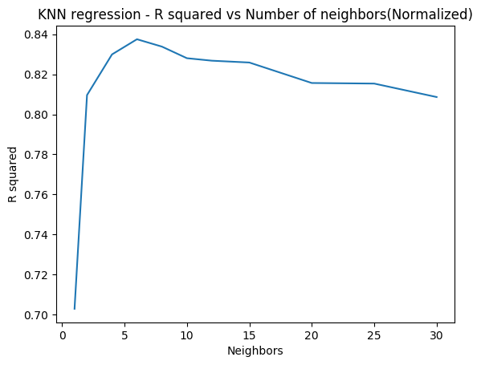

```{python}
import numpy as np
import matplotlib.pyplot as plt
a=np.arange(10)
b=np.arange(10)
fig=plt.scatter(a,b)
fig.figure.savefig('foo.png', bbox_inches='tight')
print "finished"
```

Output image:

